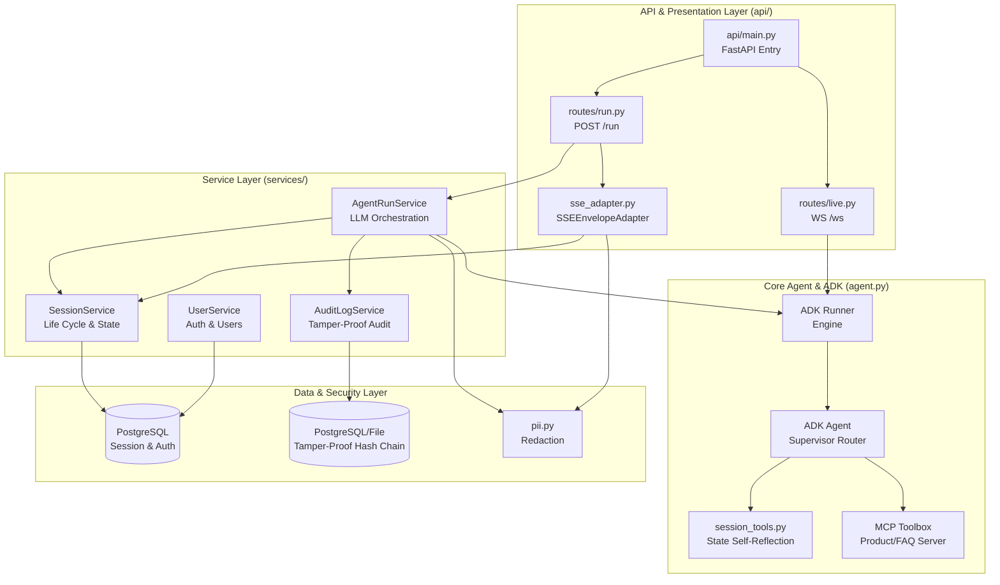
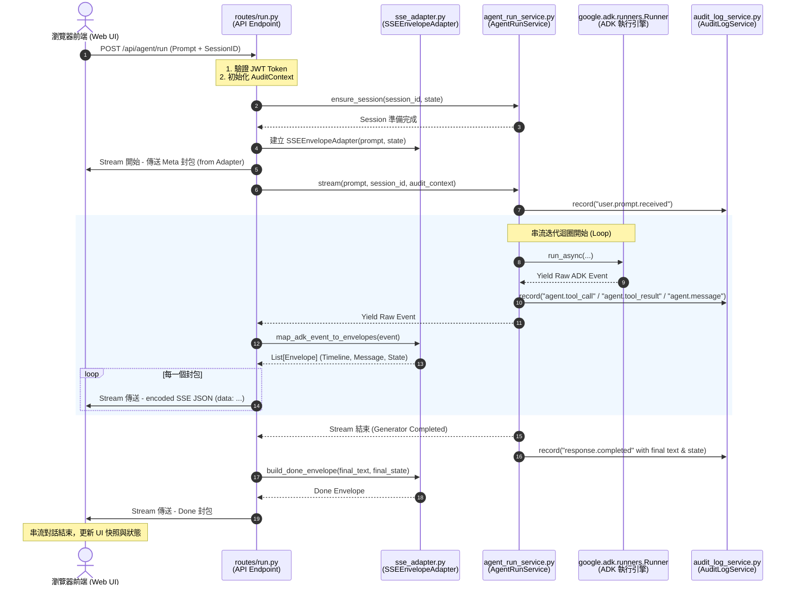

# 系統設計架構圖 (Architecture Design v1)

本文件詳述了保險推薦代理人後端系統在提取 `SSEEnvelopeAdapter` 重構後的完整架構設計、分層邊界與資料流動軌跡。

---

## 1. 系統分層架構 (System Layering & Components)

重構後，系統達到了清晰的「單向相依性」與職責分離：
- **傳輸與展示層 (API Layer / Presentation)**：負責處理 HTTP、WebSocket 與 SSE (Server-Sent Events) 等傳輸協議，包括認證 (JWT) 與 Pydantic DTO (Schemas) 校驗。
- **適配層 (Adapter Layer)**：`SSEEnvelopeAdapter` 與 `LiveAgentService` / `downstream` 等，負責將領域層 (Domain) 輸出的原始事件轉換為前端 UI 可辨識的數據結構。
- **業務與領域層 (Service Layer / Domain)**：`AgentRunService`、`SessionService` 等，專注於管理 ADK Runner 生命週期、PII 去敏、審計記錄與 PostgreSQL 持久化。
- **外部整合與工具集 (Agent Tools & MCP)**：包含 MCP 工具箱（用於商品搜索與 FAQ 知識庫）、Session 管理自省工具與 Underwriting A2A 遠端核保代理。

### 系統組件關係圖 (Mermaid Component Diagram)

---

## 2. 標準文字對話 SSE 串流資料流 (REST / SSE Stream Data Flow)

此圖說明了當使用者呼叫 `/api/agent/run` 時，資料與事件在重構後的 API 適配器與 Service 間是如何傳遞的。

### 資料流向圖 (Mermaid Sequence Diagram)

---

## 3. 架構設計重構優勢 (Architectural Benefits of v1)

透過本次重構，系統在以下三個維度上獲得了極高的提升：

1. **極高內聚性與職責分離 (High Cohesion & SRP)**
   - `AgentRunService` 現在是一個**深度模域服務 (Deep Module)**，其介面與內部實作完全專注於大模型（ADK Runner）的管線串接、PII 屏蔽、以及資料安全稽核日誌。它完全不知道前端採用 SSE 還是 WebSocket，亦不包含任何 UI 封包格式（Timeline, Envelope）。
   - `SSEEnvelopeAdapter` 作為專職的**展示適配器 (Presentation Adapter)**，封裝了與前端 Web UI 通訊的所有格式細節與狀態緩衝（例如打字機流式 Append 的步進文字累加、自定義工具在 Timeline 上的分類與呈現）。

2. **可維護性與 AI 導航性 (Maintainability & AI Navigability)**
   - 若未來前端 UI 的 Event History 協議需要變更欄位結構，開發人員或 AI Agent 只需要修改 `app/api/sse_adapter.py`，完全不會干涉或破壞到核心業務流程與 ADK 核心邏輯。
   - 資料庫與稽核層記錄的是真實領域的資料（Raw Events），排除了展示層序列化 JSON 的干擾。

3. **測試的 Seam 與隔離性 (Isolated Testability)**
   - **Service 層測試** 變得更加簡單、精準。現在可以撰寫純 Python 物件測試來校驗 `AgentRunService.stream` 的輸出是否包含預期的原始 `Event`，免去對複雜 UI JSON 結構的 Mock。
   - **適配層測試** 透過 `test_sse_adapter.py` 進行高度隔離測試，透過傳入 Mock `Event` 即可完整檢測前端通訊格式是否正確。
