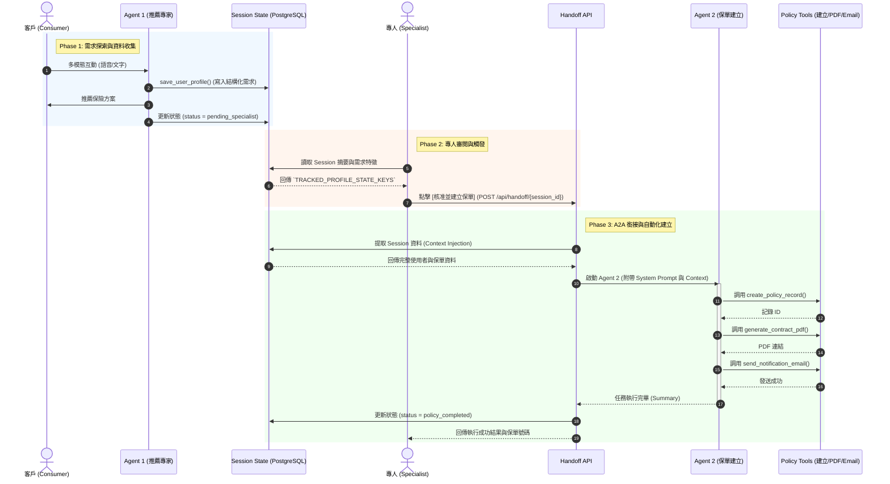

# Agent-to-Agent (A2A) Handoff Architecture Design Plan

## 1. Background & Motivation
目前系統已經具備初步的 Agent (前端保險推薦) 功能，並透過 Session 記錄使用者需求。為達到無縫銜接後續保單建立流程，我們需要導入「Agent-to-Agent (A2A) 架構」加上「Human-in-the-Loop (專人審閱)」。
專人將扮演「審閱與觸發 (Review & Trigger)」的角色，確認 Agent 1 收集到的資料後，直接觸發 Agent 2 (後勤/保單 Agent) 來完成自動化建立作業。

## 2. Architecture Overview & Handoff Flow

### 參與角色 (Roles)
- **Agent 1 (Frontend Agent)**：面對消費者，負責對話、需求探索、保險推薦，並將結構化特徵寫入 `Session State`。
- **Human Specialist (專人)**：審查者。只做「確認與觸發」，確保 Agent 1 收集的資料合規且正確。
- **Agent 2 (Backend Policy Agent)**：後端執行者。被觸發後，接收來自 Agent 1 的結構化 Context，並自主調用「保單建立」相關 Tools (API)。

### 流程時序與系統架構圖 (Workflow Timeline & Architecture Diagram)

以下是 Agent 1 到專人審核，再銜接至 Agent 2 的完整時序與交互設計：

### 詳細流程說明
1. **[Agent 1 執行期]**
   - User 與 Agent 1 進行多模態互動 (Live API)。
   - Agent 1 使用現有的 `save_user_profile` 等工具，將需求寫入 DB (Session)。
   - Agent 1 判斷可進入專人階段，更新 Session 狀態為 `status = 'pending_specialist'`。
2. **[專人審核期 (Review & Trigger)]**
   - 專人於後台介面載入該 Session，檢視系統生成的「摘要 (Summary)」與「結構化需求清單」。
   - 專人確認無誤後，點擊「核准並建立保單 (Approve & Trigger Agent 2)」。
3. **[A2A 銜接與 Agent 2 執行期]**
   - 後端 API 接收觸發請求，進行 A2A Context Handoff。
   - 系統提取 Agent 1 在 Session 中記錄的 `TRACKED_PROFILE_STATE_KEYS` 作為 Agent 2 的上下文環境 (Context Injection)。
   - **Agent 2** 啟動，其 Prompt 被限定為「流程自動化執行者」。
   - Agent 2 自動調用如 `create_policy_record()`, `generate_contract_pdf()`, `send_notification_email()` 等工具。
   - Agent 2 執行完畢，更新 Session 狀態為 `status = 'policy_completed'`。

## 3. Implementation Steps

### Phase 1: 狀態擴充與 Handoff API
- **修改 `app/session_state.py`**：新增流程狀態變數（例如：`session:status`、`session:agent1_summary`）。
- **建立 A2A Trigger API (`app/api/routes/agent2.py`)**：實作 `POST /api/handoff/{session_id}`，供專人前端呼叫。

### Phase 2: Agent 2 (Policy Agent) 實作
- **定義 Agent 2 應用 (`app/policy_agent.py`)**：使用 ADK 建立新的 Agent 實例。
- **設計 Agent 2 系統提示詞 (`app/prompts/policy_agent_prompt.txt`)**：
  - 任務目標：根據注入的 Context，依序調用工具完成保單建立。
  - 要求：不需與使用者互動，專注於工具執行 (Autonomous execution)。
- **實作保單工具 (`app/tools/policy_tools.py`)**：
  - `create_database_record(user_data)`
  - `generate_contract(policy_id)`

### Phase 3: 上下文注入與非同步調度 (Context Injection & Execution)
- 在 Trigger API 中，實作 Context 轉換邏輯：讀取 PostgreSQL 中的 Session，轉換為 Agent 2 可讀的 System Instruction 或 User Message。
- 呼叫 `Agent 2` 執行，並將執行結果 (Audit Log 或生成的保單號碼) 寫回 Session。

## 4. Verification & Testing
- **整合測試**：撰寫腳本模擬 Agent 1 寫入 Session -> 呼叫 Trigger API -> 驗證 Agent 2 是否正確調用了 `create_database_record` 等 Mock 工具。
- **Agent Evaluation (ADK Eval)**：為 Agent 2 撰寫評估集 (Evalset)，確保在不同邊界條件的 Context 注入下，Agent 2 都能正確決策並完成保單建立。
