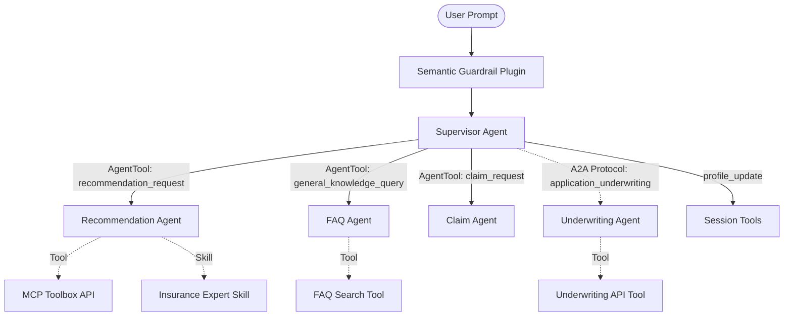

# Phase 2: ADK Native A2A (Agent-to-Agent) Refactoring Plan

## 1. 背景與動機 (Background & Motivation)

目前系統採用單體架構 (Monolithic Agent)，將意圖分流、狀態更新、商品檢索與 FAQ 查詢全部耦合在 `app/prompts/insurance_agent_prompt.txt` 中。這種設計雖然初期開發快速，但隨著功能擴展，單一 Prompt 會變得過度肥大、注意力容易分散，且每次呼叫都會帶著龐大的上下文，影響推理效率與精準度。

本階段 (Phase 2) 旨在根據企業藍圖，導入代理人協作機制，將大腦拆分為「Supervisor（監督路由器）+ 專業子代理人（Recommendation/FAQ/Claim/Underwriting）」，實現職責分離 (Separation of Concerns)。

其中 Recommendation、FAQ 與 Claim 採用進程內 (In-Process) 的 `AgentTool` 呼叫以維持零網路延遲（< 1ms），而 Underwriting Agent 則採用標準的分散式 A2A (Agent-to-Agent) 通訊協議（參考 `https://a2a-protocol.org/latest/`）與外部獨立系統界接。

## 2. 範圍與影響 (Scope & Impact)

*   **影響範圍：**
    *   `app/agent.py`：將重構為支援多代理人建立、`AgentTool` 註冊與 A2A 外部通訊的架構。
    *   `app/prompts/`：拆分單體 Prompt 為 Supervisor 與各子代理人的專屬 Prompt。
    *   `app/container.py`：調整依賴注入，以 Supervisor 為 `root_agent` 進行初始化。
*   **不影響範圍：**
    *   Phase 1 已完成的 `SemanticGuardrailPlugin` (維持在 App 層級攔截)。
    *   現有 `app/tools/session_tools.py` 的實作細節。

## 3. 提議架構 (Proposed Architecture)

採用樹狀路由架構。其中 Recommendation、FAQ 與 Claim 代理人皆在同一個 Cloud Run 容器進程內運行 (使用 `AgentTool`)，而 Underwriting Agent 則做為外部獨立服務運作。



### 3.1 代理人職責分配

1.  **Supervisor Agent**
    *   **定位：** 意圖分流與槽位提取 (Slot-filling)。
    *   **Prompt：** 僅需專注判斷用戶意圖（推薦、FAQ、理賠、投保/核保、狀態更新）。
    *   **配備工具：**
        *   `get_user_profile_snapshot`
        *   `save_user_profile`
        *   將 Recommendation、FAQ 與 Claim 3 個 Agent 以進程內 `AgentTool` 的形式註冊。
        *   將 Underwriting Agent 透過分散式 A2A 協議 (參考 `https://a2a-protocol.org/latest/`) 以 A2A 整合工具形式掛載。
2.  **Recommendation Agent (Rec Agent)**
    *   **定位：** 專注商品選配與推薦。
    *   **Prompt：** 商品挑選邏輯與推薦回應格式 (必須輸出 JSON 卡片)。
    *   **配備工具：**
        *   MCP Toolbox 內的 `search_*_products`, `get_product_detail` 等查詢工具。
        *   `save_last_recommendation`, `clear_last_recommendation`。
        *   動態加載 `insurance-agent-skill`。
3.  **FAQ Agent**
    *   **定位：** 專注保險名詞解釋與條款問答。
    *   **Prompt：** 專業、中立地回答保險知識。
    *   **配備工具：** MCP Toolbox 的 `search_faq` 工具（未來可無縫切換至 Phase 3 的 pgvector 檢索）。
4.  **Claim Agent**
    *   **定位：** 處理理賠導航。
    *   **Prompt：** 引導用戶收集理賠文件、安撫情緒。
    *   **配備工具：** 理賠試算相關的 mock 工具 (視現有 MCP 支援程度而定，或先使用 Dummy Tool 佔位)。
5.  **Underwriting Agent (核保代理人) [新增]**
    *   **定位：** 處理用戶投保意願與核保流程。
    *   **設計：** 採用分散式 A2A 設計 (參考 `https://a2a-protocol.org/latest/`)，實現跨服務的安全代理人通訊。
    *   **Prompt：** 審查用戶提供的個人資訊（年齡、職業、健康狀況等）與選擇的保單，評估是否滿足核保條件，並引導後續作業。
    *   **配備工具：** `submit_application` (呼叫後端 API 進行進件與初步核保)。

### 3.2 投保與核保 A2A 流程設計 (Application & Underwriting A2A Flow)

為實現用戶從「推薦」過渡到「投保」的無縫體驗，設計以下 A2A 交互流程：

1.  **觸發意圖：** 用戶在接收到保單推薦後，表達投保意願，並提供個人資訊（例如：「我決定買 A 保單，我是工程師，今年 30 歲」）。
2.  **Supervisor 路由：**
    *   Supervisor Agent 攔截到此意圖，判斷為 `application_underwriting` (投保)。
    *   Supervisor 從上下文提取用戶提供的**個人資訊**以及**選擇的保單**。
    *   Supervisor 透過 **A2A Protocol 跨系統通訊** 呼叫外部的 `Underwriting Agent`，並將提取出的資訊與對話狀態作為 A2A Payload 傳遞。
3.  **Underwriting Agent 處理：**
    *   接收到參數後，檢查個人資訊是否完整。若有缺漏（例如缺少健康告知），則向用戶提問。
    *   資料完備後，呼叫 `submit_application` 工具，將資料送交後端進行初步核保與建檔。
    *   獲取 API 處理結果後，將核保結果（如：核保通過、需人工審核等）封裝為 A2A 回應回傳給 Supervisor。
4.  **回覆用戶：** Supervisor 收到 Underwriting Agent 的 A2A 回傳後，將結果轉化為自然語言回覆給用戶，完成投保流程。

#### 3.2.1 ADK SDK 實作細節 (ADK SDK Implementation Details)

為了實踐上述 A2A 流程，我們利用 Google ADK 的 `RemoteA2aAgent` 與 `to_a2a` 方法進行開發：

1.  **核保端 (Provider Side):**
    *   獨立定義 Underwriting Agent，並配置對應的實體工具（如：`submit_application`）：
        ```python
        # app/underwriting_agent.py
        from google.adk.agents import Agent
        from app.tools.underwriting_tools import submit_application

        underwriting_agent = Agent(
            name="underwriting_agent",
            model="gemini-flash-latest",
            instruction=open("app/prompts/underwriting_prompt.txt").read(),
            description="處理用戶投保意願與核保流程，評估是否滿足核保條件。",
            tools=[submit_application]
        )
        ```
    *   使用 ADK 原生的 A2A 工具將其暴露為 HTTP A2A 服務（預設監聽在 `8001` 埠，此時會自動對外廣播包含 `/agent_card` 的 Well-Known 端點）：
        ```python
        # app/underwriting_server.py
        from google.adk.a2a.utils.agent_to_a2a import to_a2a
        from app.underwriting_agent import underwriting_agent

        if __name__ == "__main__":
            # 啟動外部核保 Agent 服務
            to_a2a(underwriting_agent, port=8001)
        ```

2.  **Supervisor 端 (Consumer Side):**
    *   在 Supervisor 端，我們不需要實例化整個外部核保代理人的 Python 代碼，而是透過 `RemoteA2aAgent` 指向其 A2A 端點來遠端消費它：
        ```python
        # app/agent.py (部分代碼)
        from google.adk.agents import Agent
        from google.adk.agents.remote_a2a_agent import RemoteA2aAgent, AGENT_CARD_WELL_KNOWN_PATH
        from google.adk.tools import AgentTool

        def create_supervisor_agent():
            # 建立遠端 Underwriting Agent 代理實例
            remote_underwriting = RemoteA2aAgent(
                name="underwriting_agent",
                description="負責核保評估與保單進件。當用戶表示要購買、投保、進行核保時，必須調用此代理人。",
                agent_card=f"http://underwriting-service:8001{AGENT_CARD_WELL_KNOWN_PATH}",
            )

            # 將遠端 Agent 包裝成 AgentTool
            underwriting_tool = AgentTool(remote_underwriting)

            # 建立進程內子代理人 (Recommendation / FAQ / Claim) 的 AgentTool
            rec_tool = AgentTool(create_recommendation_agent())
            faq_tool = AgentTool(create_faq_agent())
            claim_tool = AgentTool(create_claim_agent())

            # 初始化 Supervisor，將 In-Process 與 Remote A2A 混合掛載在 tools 列表中
            supervisor_agent = Agent(
                name="supervisor_agent",
                model="gemini-flash-latest",
                instruction=open("app/prompts/supervisor_prompt.txt").read(),
                tools=[
                    rec_tool,
                    faq_tool,
                    claim_tool,
                    underwriting_tool,  # 標準 A2A 整合
                ]
            )
            return supervisor_agent
        ```

## 4. 實作步驟 (Implementation Plan)

### Step 1: Prompt 拆分與精簡
在 `app/prompts/` 下建立新的 Prompt 檔案：
*   `supervisor_prompt.txt`：負責意圖分類（recommendation, follow_up, update, faq, claim, underwriting）以及如何委派任務給子代理人。
*   `recommendation_prompt.txt`：繼承原本商品推薦、JSON 卡片輸出、回合控制（Turn Management）的相關指示。
*   `faq_prompt.txt`：負責引導使用 `search_faq` 工具，並以簡潔方式回覆。
*   `claim_prompt.txt`：建立初步的理賠導航指南。
*   `underwriting_prompt.txt`：**[新增]** 負責引導核保資訊收集與 API 工具調用。
*   *(完成後可將原 `insurance_agent_prompt.txt` 歸檔 or 刪除)*

### Step 2: 重構 Agent 實例化邏輯
修改 `app/agent.py`，新增各個子代理人的建立函式，並實作 Supervisor 註冊邏輯：
*   定義 `create_recommendation_agent()`、`create_faq_agent()`、`create_claim_agent()`。
*   使用 `AgentTool` 包裝上述 3 個進程內 (In-Process) 運行的代理人。
*   實作一個 **A2A 通訊客戶端工具** 用於對接外部的 `Underwriting Agent` (符合 `https://a2a-protocol.org/latest/` 規範)。
*   定義 `create_supervisor_agent()`，將 `AgentTool` 以及 A2A 客戶端工具放入其 `tools` 列表中。

### Step 3: 調整依賴注入 (Container)
修改 `app/container.py`：
*   確保 `root_agent` 現在是由 `AgentFactory` 產出的 Supervisor Agent。
*   針對 Live API 環境 (`live_agent`)，建立同樣的 A2A/AgentTool 結構，確保 Multimodal Live 串流也能享有子代理人調度的好處。

### Step 4: 測試與驗證 (Verification)
*   **單元測試：** 執行 `uv run pytest tests/unit/test_agent.py`，確保 Supervisor 正確建立且擁有進程內子代理人及外部 A2A 工具。
*   **整合測試：** 透過 `make test` 與 `make eval`，驗證投保 A2A 呼叫流程正常，特別是 Supervisor 與 Underwriting Agent 之間的 A2A 協議資料傳遞與網路連線。
*   **效能測試：** 確認 `AgentTool` 調用的延遲在 In-process 架構下無明顯體感延遲（符合 < 1ms 目標），並監控跨系統 A2A 呼叫的連線延遲。

## 5. 替代方案 (Alternatives Considered)

*   **全 REST API 微服務拆分：** 將所有子代理人部署為獨立的 Cloud Run Service，透過 HTTP 互相呼叫。
    *   **缺點：** 會引入不必要的網路延遲、認證複雜度增加、且 SSE 串流轉發難度高，違背低延遲（特別是針對未來的 Live API）的目標。
    *   **決策：** 否決。採用混合架構：核心高頻子代理人使用 ADK 原生 In-process `AgentTool`最大化效能，而與核保等外部獨立大型系統之整合，則採用標準 A2A 通訊協議以保持架構解耦。
